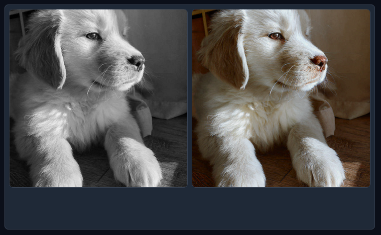

# ColorizeNet

This model is a ControlNet based on SD-v2.1, trained for image colorization from black and white images.

## Model Details

### Model Description

ColorizeNet is an image colorization model based on ControlNet, trained using the pre-trained Stable Diffusion model version 2.1 proposed by Stability AI.

- **Finetuned from model :** [https://huggingface.co/stabilityai/stable-diffusion-2-1]

## Usage

### Training Data

<!-- This should link to a Data Card, perhaps with a short stub of information on what the training data is all about as well as documentation related to data pre-processing or additional filtering. -->

The model has been trained on [COCO](https://huggingface.co/datasets/detection-datasets/coco), using all the images in the dataset and converting them to grayscale to use them to condition the ControlNet. To train the model, you also need a JSON file specifying the input prompt and the source and target images. The file used for training is reported in `data/colorization/training/prompts.json`. Prompts were obtained by randomly choosing one among similar prompts for each image pair.

### Run the model with Gradio

Run the `gradio_colorization.py` and load your image via the interface. The results have been generated without using additional text prompts.

## Results

## Additional Resources
For more information on ControlNet, please refer to the [original repository](https://github.com/lllyasviel/ControlNet)
